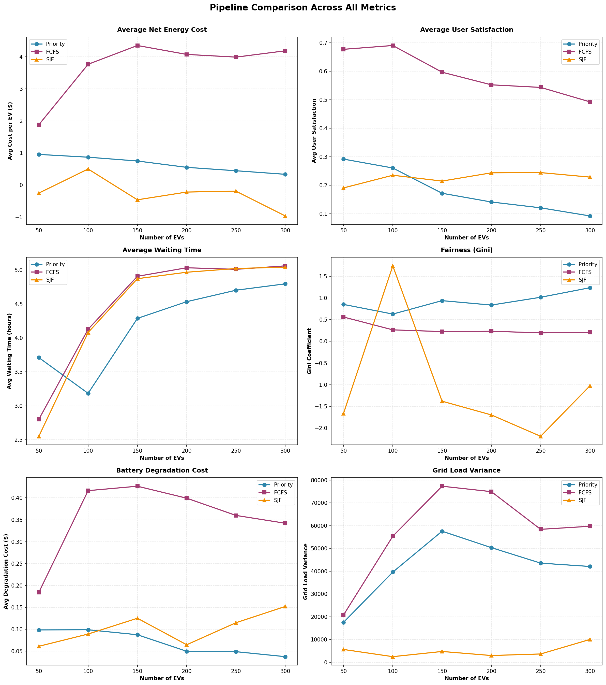

# Optimal Cost Reduction in Electric Vehicle Charge-Discharge Scheduling

This repository implements a **two-stage EV charge/discharge scheduling framework** that combines **Priority Scheduling** (Stage-I) with **Genetic Algorithm (GA) Optimization** (Stage-II). The goal is to minimize operational costs (energy + degradation + grid stress) while maximizing user satisfaction under strict physical and operational constraints.

## 🚀 Project Overview

The system simulates a workplace charging station where EVs arrive with different requirements (arrival time, departure time, energy demand). The scheduling process involves:

1.  **Stage-I (Admission Control):** Assigns limited chargers ($M=30$) to a pool of EVs ($N=50-300$) using a priority-based algorithm.
2.  **Stage-II (Power Scheduling):** Optimizes the charging/discharging power profile for admitted EVs over a 24-hour horizon ($T=96$ slots of 15 mins) using a Genetic Algorithm.

### Key Features
*   **Three Admission Strategies:**
    *   **Priority:** Based on urgency, price sensitivity, and grid stress.
    *   **FCFS (First-Come, First-Served):** Prioritizes early arrivals.
    *   **SJF (Shortest Job First):** Prioritizes EVs with the smallest energy demand.
*   **V2G Support:** Vehicle-to-Grid capability allows EVs to discharge battery power back to the grid during peak price hours.
*   **Multi-Objective Optimization:** Minimizes a weighted sum of:
    *   $F_1$: Net Energy Cost (Time-of-Use pricing)
    *   $F_2$: Battery Degradation Cost
    *   $F_3$: Grid Load Variance
    *   $F_4$: User Dissatisfaction (Penalty for unfulfilled energy)

---

## 📂 Project Structure

```
.
├── pipeline.py                 # Priority Scheduling + GA Pipeline
├── pipeline_fcfs.py            # FCFS Scheduling + GA Pipeline
├── pipeline_sjf.py             # SJF Scheduling + GA Pipeline
├── generate_ev_datasets.py     # Script to generate realistic EV datasets
├── run_pipeline_comparison.py  # Orchestrator for running all experiments
├── plot_pipeline_comparison.py # Visualization script for results
├── comparison_results.csv      # Metrics from all experiments
├── comparison_combined.png     # Summary plot of all metrics
├── evs_*.csv                   # Generated EV datasets (50-300 EVs)
└── README.md                   # Project documentation
```

---

## ⚙️ Algorithms & Pipeline

### Stage-I: Priority Scheduling
Calculates a priority score $\lambda_i(t)$ for each EV $i$ at time slot $t$:
$$ \lambda_i(t) = \alpha \cdot U_i(t) + \beta \cdot P(t) + \gamma \cdot L(t) $$
Where:
*   $U_i(t)$: Urgency (Laxity) - how close the deadline is.
*   $P(t)$: Electricity Price - higher price = lower priority for charging.
*   $L(t)$: Grid Load - higher load = lower priority.

### Stage-II: Genetic Algorithm (GA)
*   **Encoding:** Real-valued chromosome representing power $P_{i,t}$ for each admitted EV $i$ at each slot $t$.
*   **Crossover:** Simulated Binary Crossover (SBX).
*   **Mutation:** Polynomial Mutation.
*   **Selection:** Tournament Selection.
*   **Repair Operator:** A lightweight repair function enforces hard constraints (bounds, windows, occupancy) without biasing the search.

### Constraints & Penalties
The system enforces the following constraints. Violations add a heavy penalty $\Omega$ to the objective function:
1.  **Power Bounds:** $P_{min} \le P_{i,t} \le P_{max}$ (Physical charger limits).
2.  **SoC Limits:** $SoC_{min} \le SoC_{i,t} \le SoC_{max}$ (Battery safety).
3.  **Time Windows:** $P_{i,t} = 0$ if $t < T_{arr}$ or $t > T_{dep}$.
4.  **Charger Occupancy:** $\sum_{i} z_{i,t} \le M$ (Cannot exceed available chargers).
5.  **Grid Capacity:** Total load $\le P_{grid, max}$.

---

## 📊 Experimental Results

We compared the three strategies across EV fleet sizes from 50 to 300.

### Summary of Findings

| Metric | Winner | Why? |
|--------|--------|------|
| **Energy Cost** | **SJF** | Prioritizes short, flexible jobs, allowing aggressive V2G usage (negative costs). |
| **Satisfaction** | **FCFS** | Prioritizes service quality, ensuring most EVs get charged fully. |
| **Waiting Time** | **SJF** | Shortest jobs clear the queue fastest, minimizing average wait. |
| **Fairness (Gini)** | **FCFS** | Treats all users equally based on arrival time. |

### Visual Comparison


---

## 🛠️ Setup & Usage

### Prerequisites
*   Python 3.8+
*   Dependencies: `numpy`, `pandas`, `matplotlib`, `deap`

### Installation
```bash
# Create virtual environment
python3 -m venv .venv
source .venv/bin/activate

# Install dependencies
pip install numpy pandas matplotlib deap
```

### Running Experiments
1.  **Generate Datasets:**
    ```bash
    python generate_ev_datasets.py --counts 50 100 150 200 250 300
    ```

2.  **Run Full Comparison (Long Running):**
    ```bash
    python run_pipeline_comparison.py
    ```
    *This runs all 3 pipelines for all 6 EV counts (18 total runs).*

3.  **Generate Plots:**
    ```bash
    python plot_pipeline_comparison.py
    ```

### Running Individual Pipelines
You can run a specific strategy for a specific EV file:
```bash
python pipeline.py --ev-file evs_50.csv --chargers 30 --ngen 200
python pipeline_fcfs.py --ev-file evs_100.csv --chargers 30 --ngen 200
python pipeline_sjf.py --ev-file evs_150.csv --chargers 30 --ngen 200
```

---

## 📝 Assumptions
1.  **Bidirectional Chargers:** All chargers support V2G (discharge).
2.  **Price Knowledge:** Day-ahead pricing is known perfectly.
3.  **Linear Battery Model:** Charging/discharging efficiency is constant (assumed 1.0 for simplicity in this model, but configurable).
4.  **Continuous Power:** Chargers can deliver any power value between $P_{min}$ and $P_{max}$.

## 📧 Contact
For questions or contributions, please open an issue or contact the repository owner.
